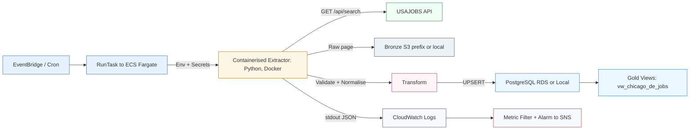

# Architecture Diagram

```mermaid
flowchart LR
    EB[EventBridge / Cron] --> RT[RunTask to ECS Fargate]
    RT -->|Env + Secrets| CNT[Containerised Extractor: Python, Docker]
    CNT -->|GET /api/search| USA[USAJOBS API]
    CNT -->|Raw page| BR[Bronze S3 prefix or local]
    CNT -->|Validate + Normalise| XFORM[Transform]
    XFORM -->|UPSERT| PG[PostgreSQL RDS or Local]
    PG --> GV[Gold Views: vw_chicago_de_jobs]
    CNT -->|stdout JSON| CW[CloudWatch Logs]
    CW --> AL[Metric Filter + Alarm to SNS]

    style EB fill:#e6f3ff,stroke:#2b6cb0
    style RT fill:#e6f3ff,stroke:#2b6cb0
    style CNT fill:#fff7e6,stroke:#b7791f
    style USA fill:#f0fff4,stroke:#2f855a
    style BR fill:#edf2f7,stroke:#4a5568
    style XFORM fill:#fff5f7,stroke:#b83280
    style PG fill:#ebf8ff,stroke:#3182ce
    style GV fill:#ebf8ff,stroke:#3182ce
    style CW fill:#f7fafc,stroke:#4a5568
    style AL fill:#f7fafc,stroke:#c53030
```
