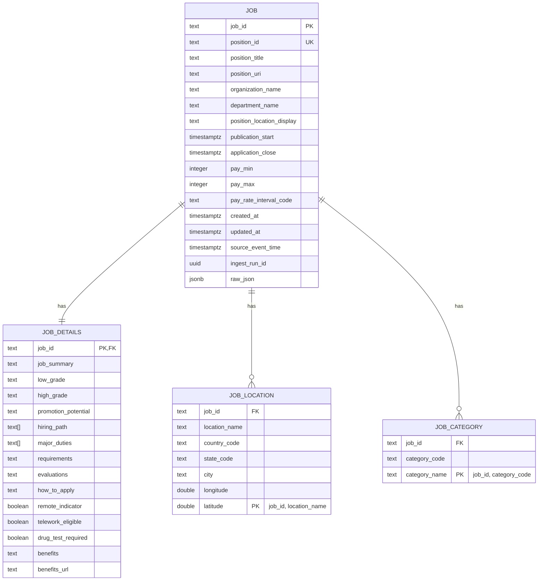

# Entity-Relationship Diagram

```mermaid
erDiagram
  JOB ||--|| JOB_DETAILS : has
  JOB ||--o{ JOB_LOCATION : has
  JOB ||--o{ JOB_CATEGORY : has

  JOB {
    text job_id PK
    text position_id UK
    text position_title
    text position_uri
    text organization_name
    text department_name
    text position_location_display
    timestamptz publication_start
    timestamptz application_close
    integer pay_min
    integer pay_max
    text pay_rate_interval_code
    timestamptz created_at
    timestamptz updated_at
    timestamptz source_event_time
    uuid ingest_run_id
    jsonb raw_json
  }

  JOB_DETAILS {
    text job_id PK, FK
    text job_summary
    text low_grade
    text high_grade
    text promotion_potential
    text[] hiring_path
    text[] major_duties
    text requirements
    text evaluations
    text how_to_apply
    boolean remote_indicator
    boolean telework_eligible
    boolean drug_test_required
    text benefits
    text benefits_url
  }

  JOB_LOCATION {
    text job_id FK
    text location_name
    text country_code
    text state_code
    text city
    double longitude
    double latitude
    PK "job_id, location_name"
  }

  JOB_CATEGORY {
    text job_id FK
    text category_code
    text category_name
    PK "job_id, category_code"
  }
```
